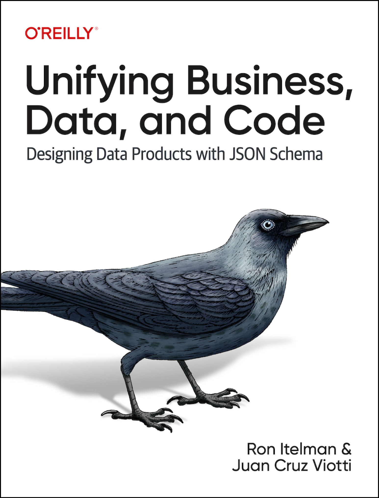

### Hey there 👋

Hey there! I'm a Computer Scientist with experience in startups, open-source,
and academia. Some facts about me: 

- At [Postman](https://www.postman.com), I lead the development of Starship, a
  C++ framework to create cross-platform native applications 

- I co-authored an O'Reilly book: [Unifying Business, Data, and Code: Designing
  Data Products with JSON
  Schema](https://learning.oreilly.com/library/view/unifying-business-data/9781098144999/).
  Read it online on
  [O'Reilly](https://learning.oreilly.com/library/view/unifying-business-data/9781098144999/),
  or buy it from [Amazon](https://www.amazon.com/_/dp/1098145003) and
  [eBooks.com](https://www.ebooks.com/search/?term=9781098145002&affid=OMI5374258).

- At University of Oxford, I won the 2022 CAR Hoare prize for the best
  dissertation and accompanying papers in the area of Software Engineering for
  my research around [JSON BinPack](https://www.jsonbinpack.org). JSON BinPack
  made a breakthrough on 40 years of space-efficient telecommunication and
  binary serialization technologies, being more space-efficient than 13 other
  popular technologies [in every single tested
  case](https://arxiv.org/abs/2211.12799) 

- I'm the original author of [Etcher](https://www.balena.io/etcher/), a popular
  open-source cross-platform image flasher. This desktop app is recommended by
  a range of GNU/Linux distributions, and was highlighted on magazine

- I lead a London-based C++ open-source research lab called
  [Sourcemeta](https://www.sourcemeta.com) providing cutting-edge JSON-related
  technologies. There, I maintain a custom JSON parser, JSON binary
  technologies, and a variety of JSON Schema related projects 

- I own the [Learn JSON Schema](https://www.learnjsonschema.com/) reference
  documentation website, which serves more than 7k monthly users

#### Links

- Personal website (https://www.jviotti.com)
- LinkedIn (https://www.linkedin.com/in/jviotti/)
- Buy me a coffee (https://ko-fi.com/jviotti or https://www.buymeacoffee.com/jviotti)
- Sponsor me on GitHub (https://github.com/sponsors/jviotti)
- Book a 1-on-1 (https://topmate.io/jviotti)
